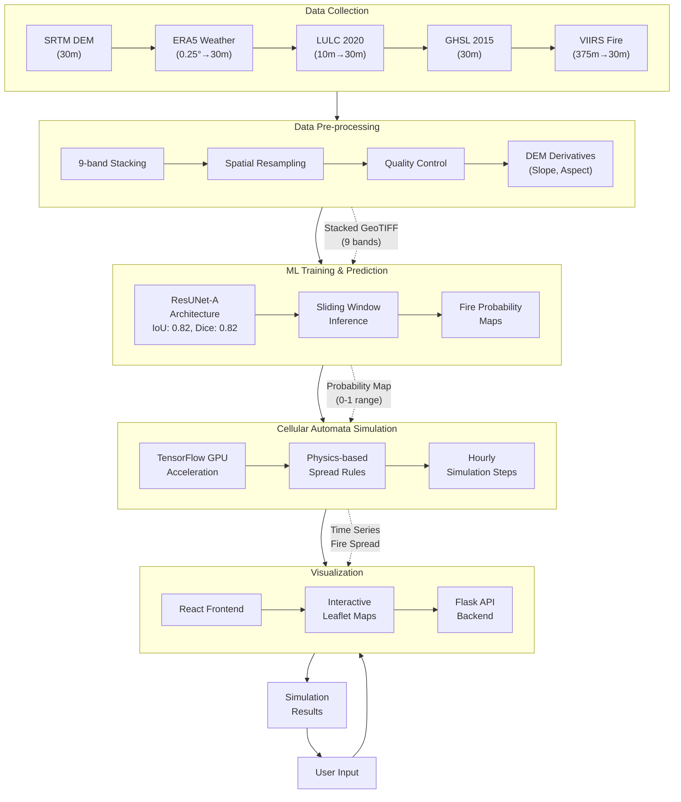
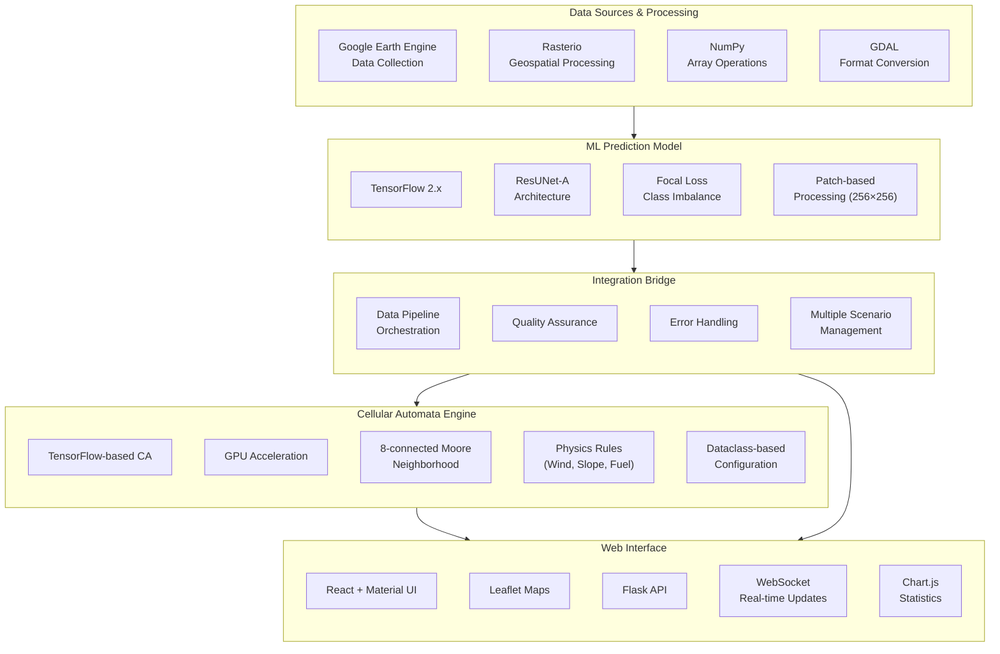
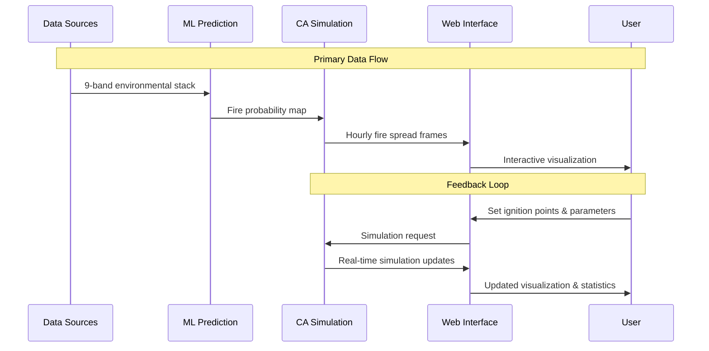
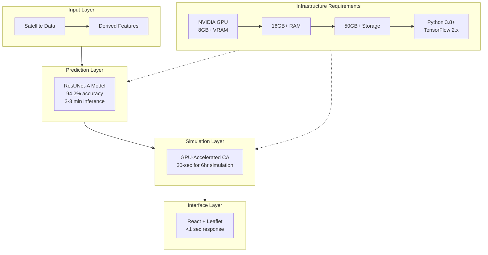

# Mermaid Diagrams for Forest Fire Spread Simulation System

This file contains Mermaid diagram code for visualizing the architecture of the Forest Fire Spread Simulation System.

## Main Process Flow Diagram

## Component Architecture Diagram

## Data Flow Diagram

## System Architecture Overview

These diagrams provide a visual representation of the Forest Fire Spread Simulation System architecture, focusing on the main process flow, component interactions, data flow, and system requirements.

The diagrams are designed to be clear and concise while highlighting the key technologies, performance characteristics, and data transformations throughout the system.
