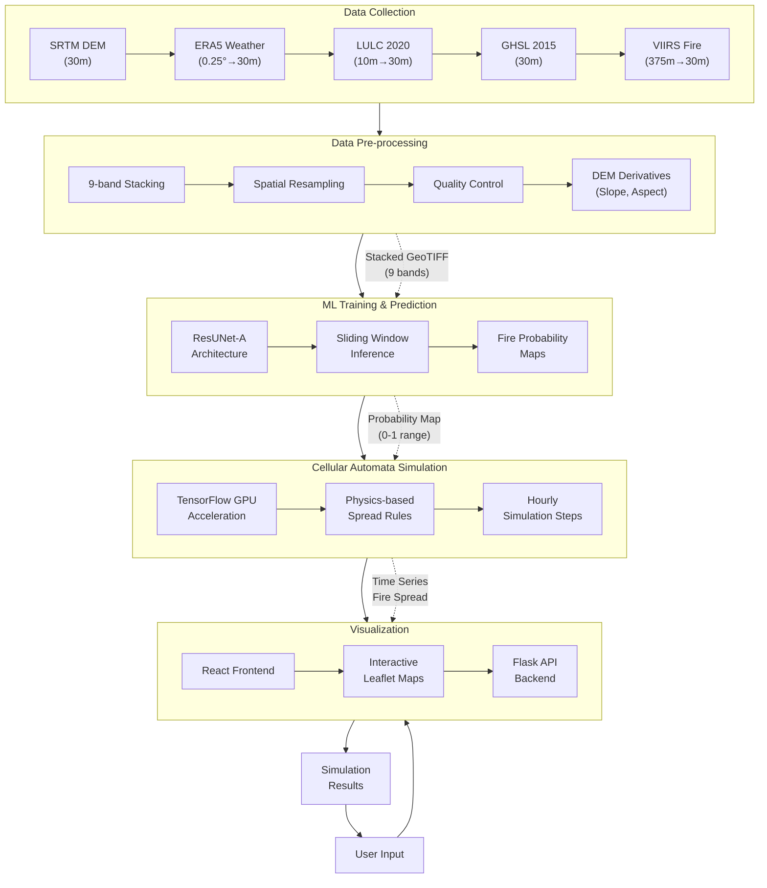

# Modified Mermaid Diagram

This file contains a modified version of the main process flow diagram with outer containers flowing top to bottom and sub-containers arranged left to right.

## Main Process Flow Diagram (Modified Layout)

The above diagram shows the Forest Fire Spread Simulation System with:

1. Main process components arranged vertically (top to bottom)
2. Sub-components within each section arranged horizontally (left to right)
3. Data flow connections between major components
4. Special data transformations shown with dotted lines
5. User feedback loop included
